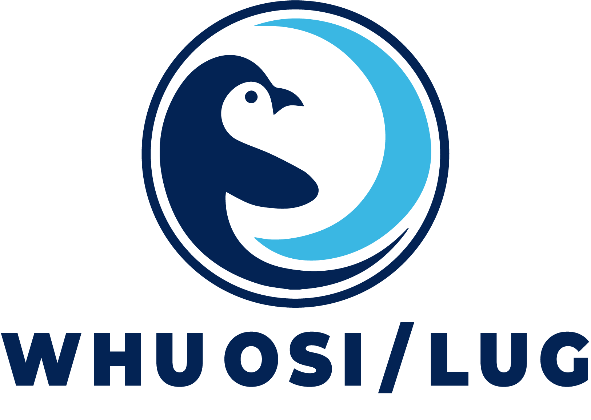

<!-- 
  欢迎来到 WHU OSI / LUG 的 GitHub 首页！
  请将下面的 [占位符] 替换为你们组织的真实信息。
  例如：将 [你们的 Logo 图片链接] 替换为 Logo 的 URL。
-->

  
  <h1><b>武汉大学开源软件协会 & Linux 用户组</b></h1>
  <h3>WHU Open Source Initiative / Linux User Group</h3>
  
  

    
  

---

  <a href="#关于我们-about-us">关于我们</a> •
  <a href="#我们的活动-what-we-do">我们的活动</a> •
  <a href="#精选项目-featured-projects">精选项目</a> •
  <a href="#如何加入我们-how-to-join-us">如何加入</a> •
  <a href="#行为准则-code-of-conduct">行为准则</a>

---

## 关于我们 (About Us)

我们是**武汉大学的学生技术社团**，由一群对开源软件、Linux 系统和前沿技术充满热情的同学组成。WHU OSI / LUG 致力于在武汉大学营造一个开放、包容、互助的技术交流社群，推广开源文化和自由软件精神。

在这里，我们相信**分享是最好的学习方式**。无论你是刚接触编程的萌新，还是精通某项技术的大佬，我们都欢迎你的加入，欢迎你分享你的想法，一起探索技术的无限可能！

> Our mission is to foster a vibrant community at Wuhan University dedicated to **open-source culture, Linux technology, and the spirit of free software**. We believe in learning by doing, sharing knowledge, and collaborating on exciting projects.

## 我们的活动 (What We Do)

我们定期组织丰富多彩的线上及线下活动，帮助成员提升技术能力、拓宽视野：

- 💻 **技术分享会:** 邀请校内外技术达人分享前沿技术与实践经验。
- 🔧 **动手工作坊:** 从 Git 入门、Linux 环境配置到开发第一个开源项目，这里有动手实践的机会。
- 🌐 **开源项目贡献:** 组织团队参与开源社区活动，或共同维护社区的开源项目。
- 🧠 **学习小组:** 针对特定领域（如 Rust、Transformer）成立学习 / 研究小组，共同进步。

## 精选项目 (Featured Projects)

这里是我们社区成员共同维护和贡献的精选项目。欢迎 Star, Fork 和提交你的贡献！

... 或者提交Pull Request让我们看到你的项目

## 如何加入我们 (How to Join Us)

我们对所有武汉大学的在校师生开放。无论你的专业背景如何，只要你对开源和技术充满热情，我们都热烈欢迎！你可以通过这些方式加入我们：

- 随时完成入门挑战
- 新生招新季时，我们会组织招新活动
- 联系你认识的社团内同学

## 行为准则 (Code of Conduct)

为了营造一个安全、友好、包容的社区环境，我们要求所有成员和参与者遵守我们的 **[行为准则 (Code of Conduct)](./CODE_OF_CONDUCT.md)**。你也可以通过阅读它进一步了解我们的愿景。

---

  
<strong>Made with ❤️ by the WHU OSI / LUG community.</strong>

